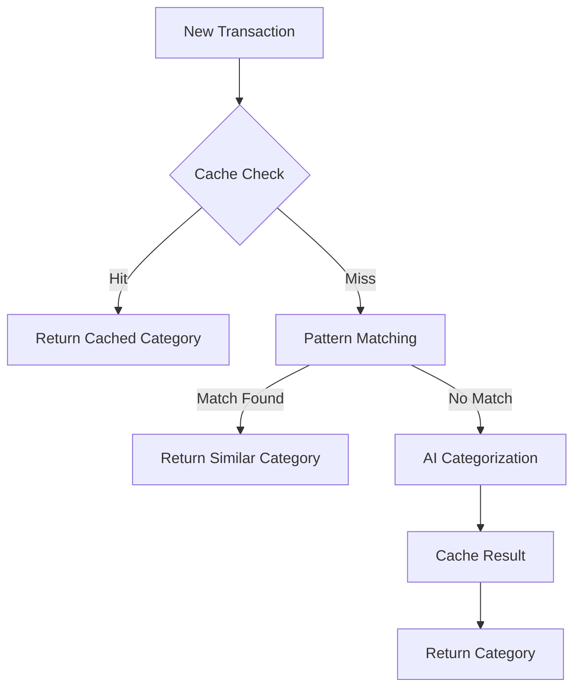

# AI Transaction Categorization & Caching System

## Overview

The Bank Statement Analyzer API uses a sophisticated AI-powered categorization system combined with an intelligent caching mechanism to provide fast, accurate transaction categorization.

## Features

### 1. AI Categorization

#### Technology Stack
- LLM (Large Language Model) for natural language processing
- Pattern recognition for transaction description analysis
- Confidence scoring system
- Multi-bank format support
- Continuous learning capabilities

#### Category Types
1. Income Categories:
   - Salary & Wages
   - Business Income
   - Investment Income
   - Rental Income
   - Miscellaneous Income

2. Expense Categories:
   - Housing/Rent
   - Utilities
   - Transportation
   - Food/Dining
   - Healthcare
   - Entertainment
   - Shopping
   - Business Expenses
   - Insurance
   - Savings/Investment

3. Special Categories:
   - NSF/Overdraft
   - Bank Fees
   - Transfers
   - Loan Payments
   - Unknown/Other

### 2. Intelligent Caching

#### Cache System
- Redis-based caching
- Hybrid storage approach
- Pattern matching for similar transactions
- Confidence threshold management
- Automatic cache updates

#### Caching Strategy
1. **First Pass**: Check cache for exact match
2. **Second Pass**: Pattern matching for similar transactions
3. **Third Pass**: AI categorization for new patterns
4. **Cache Update**: Store new categorizations

#### Performance
- Average response time: <100ms for cached items
- Cache hit rate: >85% for repeated transactions
- AI categorization time: <2s for new transactions
- Cache storage efficiency: Optimized key-value storage

### 3. Integration Flow



## Implementation Details

### 1. Cache Structure
```javascript
{
  "transactionKey": {
    "category": "string",
    "confidence": number,
    "lastUsed": timestamp,
    "useCount": number,
    "source": "cache|llm"
  }
}
```

### 2. Category Confidence Levels
- High: 0.9 - 1.0
- Medium: 0.7 - 0.89
- Low: < 0.7

### 3. Caching Rules
1. Only cache categories with confidence > 0.8
2. Expire cache entries after 90 days of non-use
3. Update confidence scores based on usage patterns
4. Store pattern variations for common transactions

## Best Practices

### 1. Transaction Description Quality
- Provide complete transaction descriptions
- Avoid abbreviated text where possible
- Include merchant names and locations
- Maintain consistent formatting

### 2. Cache Management
- Regular cache cleanup
- Monitor cache hit rates
- Update category patterns
- Validate cached categories

### 3. Performance Optimization
- Batch similar transactions
- Use pattern matching effectively
- Monitor AI service usage
- Implement rate limiting

## Troubleshooting

### Common Issues

1. **Low Confidence Scores**
   - Check transaction description quality
   - Verify merchant information
   - Review similar patterns
   - Update training data

2. **Cache Misses**
   - Verify cache connectivity
   - Check pattern matching
   - Review cache expiry settings
   - Monitor cache size

3. **Slow Response Times**
   - Check network latency
   - Monitor cache performance
   - Review AI service status
   - Optimize batch sizes

### Error Handling

```javascript
try {
  // Try cache first
  const cached = await cache.get(transactionKey);
  if (cached && cached.confidence > 0.8) {
    return cached;
  }

  // Fall back to AI categorization
  const aiResult = await aiService.categorize(transaction);
  if (aiResult.confidence > 0.8) {
    await cache.set(transactionKey, aiResult);
  }

  return aiResult;
} catch (error) {
  logger.error('Categorization error:', error);
  return {
    category: 'Uncategorized',
    confidence: 0,
    source: 'error'
  };
}
```

## Monitoring & Analytics

### Key Metrics
1. Cache Hit Rate
2. AI Service Response Time
3. Categorization Accuracy
4. Pattern Match Success Rate
5. Cache Storage Usage

### Performance Dashboard
```javascript
{
  "cacheMetrics": {
    "hitRate": "87%",
    "storageUsed": "2.3GB",
    "avgResponseTime": "45ms",
    "totalEntries": 150000
  },
  "aiMetrics": {
    "avgProcessingTime": "1.8s",
    "accuracy": "92%",
    "dailyRequests": 5000,
    "errorRate": "0.5%"
  }
}
```

## Future Enhancements

1. **AI Improvements**
   - Enhanced pattern recognition
   - Multi-language support
   - Custom category training
   - Merchant classification

2. **Cache Optimization**
   - Predictive caching
   - Regional pattern support
   - Dynamic confidence adjustments
   - Advanced pattern matching

3. **Performance**
   - Distributed caching
   - Real-time updates
   - Batch processing
   - Custom category rules
